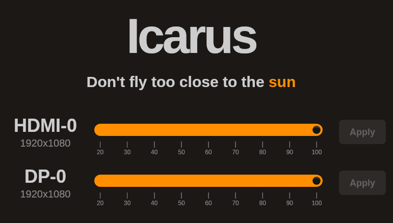
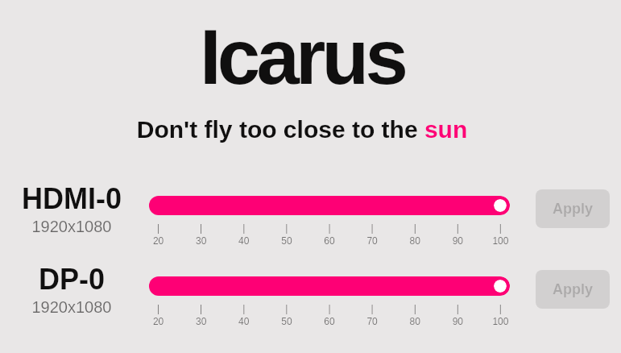

# Icarus

Simple app to protect my eyes from the power of the sun (my laptop screen) with brightness sliders in a native app. 

Built with **Tauri**. Frontend is *React/Vite* using *DaisyUI* as the UI library. Frontend interacts with a **Rust** backend that communicates with the `xrandr` program to interact with screen brightness.





## Dev

Run a local server

```
npm run dev
```

Run a lcoal server and a native app

```
npm run tauri dev
```

Build the application

```
cargo install tauri-cli
cargo tauri build
```

- Binary: `src-tauri/target/release/icarus`
- AppImage: `src-tauri/target/release/bundle/appimage/icarus_0.1.0_amd64.AppImage`
- Deb: `src-tauri/target/release/bundle/deb/icarus_0.1.0_amd64.deb`